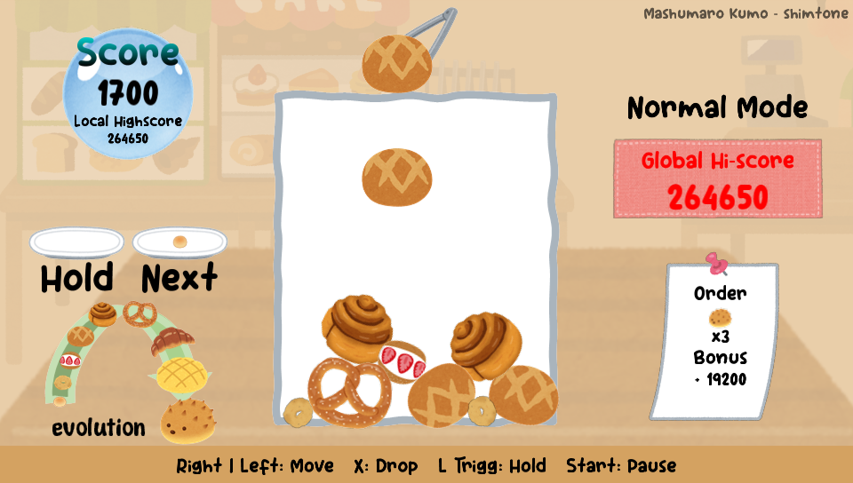

# BreadToPIA
Remake of viral Japanese game "Suika Game".
This game made in **9 days**.

## Description
A remake (demake?) of viral Japanese game "**Suika Game**" that available in Nintendo Switch.

The goals of this game is simple; merge 2 (or sometimes 3) same bread to evolve it into bigger bread. Merging bread, and completing order will earn you score. Get score as high as you can to compete globally.

**Feature:**
- 2 Gamemodes; Normal mode for casual gameplay, Time Attack Mode for more challenging gameplay.
- The highest score will be uploaded and refreshed automatically (Make sure your vita connected to Internet).
- 15 Languages! 3 of them are conlang! Why i do this to myself!
- Cute graphics, SFX, and music thanks to [いらすとや](www.irasutoya.com), [効果音ラボ](www.soundeffect-lab.info), and [DOVA-SYNDROME](www.dova-s.jp)

**Info:**
- To play comfortably, you need to overclock your PS Vita.
- The score uploaded to cloud are subject to change or to be reseted without warning or notification.
- Due to un-redistributable nature of some assets, i can't open source this project. if you need the project file, please contact me at **dragonr938@gmail.com** 

---

**V 1.0.0**
- Initial Release